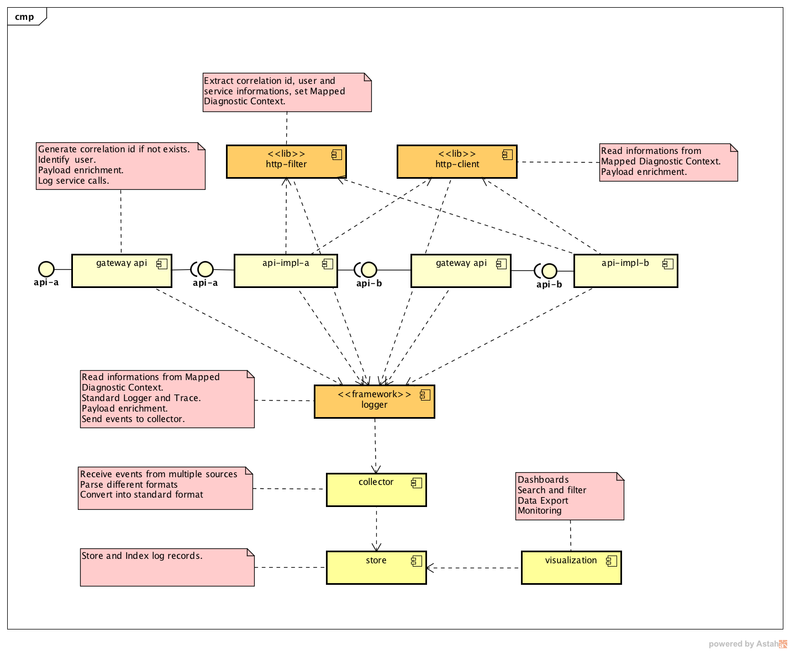
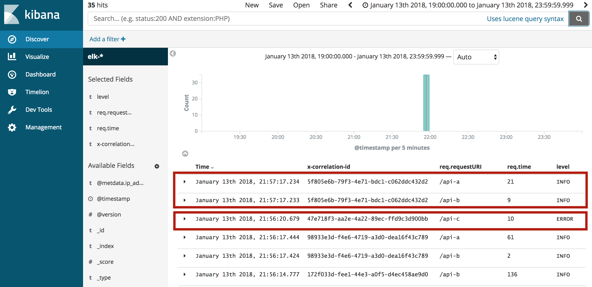

# Logs and Traces

In a SOA ecosystem we need to have strong monitoring tools, in this challenge you will design a framework to centralize logs and traces.

Logs contains information about events that happened in an application (errors, warnings and meaningful operational events). On another hand, a trace contains information about function and service calls (Service A called endpoint X in Service B successfully and it took T ms).

Requirements:
- Be able to correlate application logs with application traces.
- Be able to create a map of service calls (direct and indirect) per user request.
- Be able to add dashboards to centralize and cross information upon Logs and
Tracing.
- Prepare your system to be able to analyse data and predict failures.

## Architecture 

The proposal architecture enable the log centralization and correlation of service calls and application trace, the solution is very simple, scalable and flexible.



ELK (Logstash + Eslastic Search + Kibana)

Http Filter

Http Client

Slf4j

Spring Boot 

## Quick Start

### ELK Configuration

Logstash input configuration file *02-beats-input.conf*.
```
input {
  tcp {
    port => 5044
  }  
}
```
Logstash filter and output configuration file *30-output.conf*.

```
filter {
  json {
    source => "message"
  }
}

output {
  elasticsearch {
    hosts => ["localhost"]
    manage_template => false
    index => "elk-%{+YYYY.MM.dd}%"
  }
}
```

Build ELK docker image.

```shell
cd docker/
docker build --tag elkpoc .
```

Run ELK environment.
```shell
docker run -p 5601:5601 -p 9200:9200 -p 5044:5044 -it --name elk elkpoc
```

### Application

- /api-a -> /api-b (correlation sample)
- /api-b
- /api-c (error sample)

#### Logger configuration

Logger framework configuration *src/main/resources/logback.xml*.

```xml
<?xml version="1.0" encoding="UTF-8"?>
<configuration debug="false">
  <include resource="org/springframework/boot/logging/logback/base.xml" />
  <appender name="logstash" class="net.logstash.logback.appender.LogstashTcpSocketAppender">
    <destination>localhost:5044</destination>
    <encoder class="net.logstash.logback.encoder.LoggingEventCompositeJsonEncoder">
      <providers>
        <mdc />
        <context />
        <version />
        <logLevel />
        <loggerName />
        <pattern>
          <pattern>
            {
            "appName": "elk-logs-and-traces",
            "appVersion": "1.0"
            }
          </pattern>
        </pattern>
        <threadName />
        <stackTrace />
      </providers>
    </encoder>
  </appender>
  <root level="INFO">
    <appender-ref ref="CONSOLE" />
    <appender-ref ref="logstash" />
  </root>
  <logger name="org.springframework" level="INFO" />
  <logger name="com.poc.lat" level="INFO" />
</configuration>
```

Build and run application with api's on http://localhost:8090/.

```shell
mvn clean install
mvn spring-boot:run 
```

### POC Results

The proof of concepts have success, the implementation is very simple and transparent to development team use in applications and very useful to the operations team.



### References

[Elastic Search - store and index](https://www.elastic.co/products/elasticsearch)

[Logstash - Collection, transform, filter](https://www.elastic.co/products/logstash)

[Kibana - Data Visualization](https://www.elastic.co/products/kibana)

[Docker ELK Stack](https://github.com/spujadas/elk-docker)

[Logback configuration](https://logback.qos.ch/manual/configuration.html)

[Spring Boot Logging](https://docs.spring.io/spring-boot/docs/current/reference/html/howto-logging.html)

