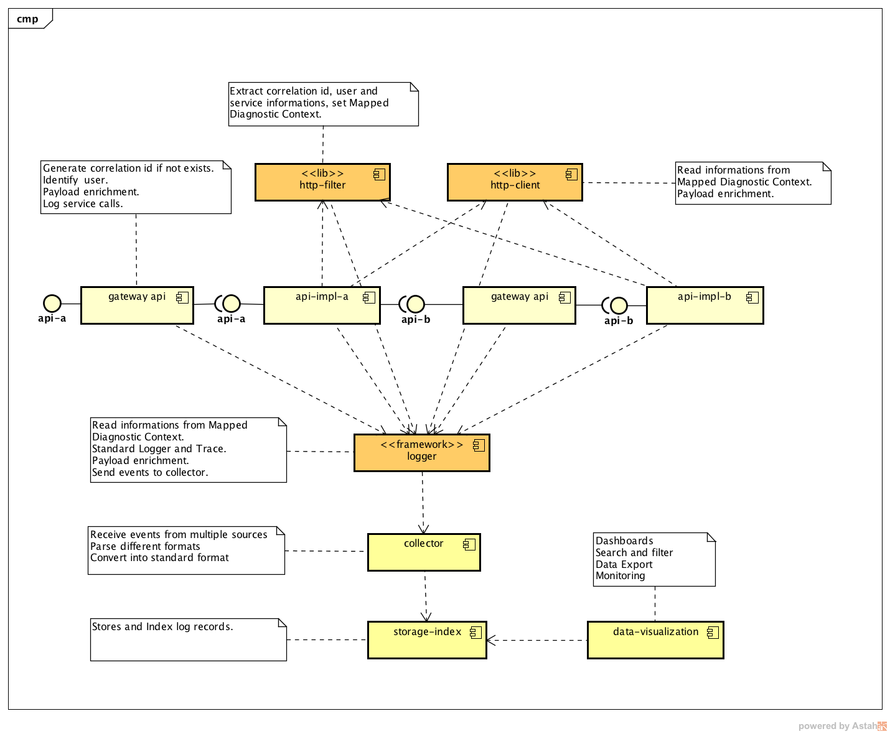
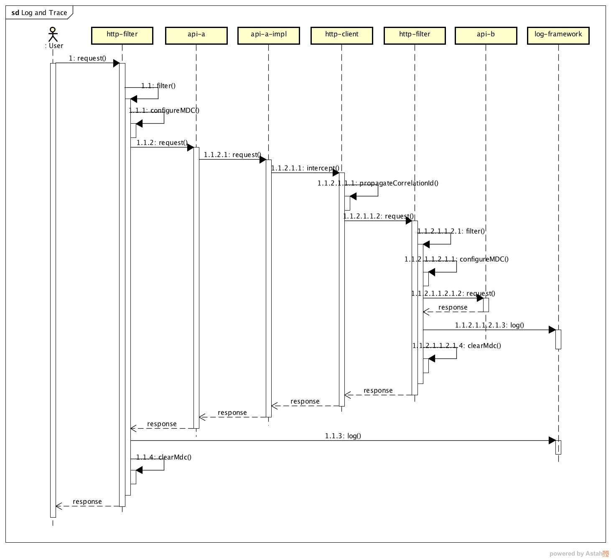

# Logs and Traces

## The Challenger

In a SOA ecosystem we need to have strong monitoring tools, the challenge is design a solution to centralize logs and traces.

Logs contains information about events that happened in an application (errors, warnings and meaningful operational events). On another hand, a trace contains information about function and service calls (Service A called endpoint X in Service B successfully and it took T ms).

Requirements:
- Be able to correlate application logs with application traces.
- Be able to create a map of service calls (direct and indirect) per user request.
- Be able to add dashboards to centralize and cross information upon Logs and
Tracing.
- Prepare your system to be able to analyse data and predict failures.

## Architecture 

The proposal architecture enables the log centralization and correlation of service calls and tracing, the solution is very powerful, scalable and flexible.

### Components

The component diagram shows the structural relationships between the main components of the architecture.



### Log and Trace

The diagram below shows the interactions between components in the sequential order of user request life cycle. 



### Storage, Index and Search

The diagram below shows the interactions between components in the sequential order of log, storage, index and search event records. 


### ELK (Logstash + Eslastic Search + Kibana)

Collector, Storage and Index, Data Visualization.

**Storage and Index**

Elasticsearch is a distributed, RESTful search and analytics engine capable of solving a growing number of use cases. As the heart of the Elastic Stack, it centrally stores your data so you can discover the expected and uncover the unexpected.

**Collector**

Logstash is an open source, server-side data processing pipeline that ingests data from a multitude of sources simultaneously, transforms it, and then sends it to your favorite “stash.”

**Data Visualization and Monitoring**

Kibana is an open source data visualization plugin for Elasticsearch. It provides visualization capabilities on top of the content indexed on an Elasticsearch cluster. Users can create bar, line and scatter plots, or pie charts and maps on top of large volumes of data.

**Http Filter**

Simple http filter *(javax.servlet.Filter)* used to create, if not exists, **x-correlation-id** of serives interactions. Responsible to configure MDC - Mapped Diagnostic Context.

**Http Client**

Simple Interceptor is used to get **x-correlation-id** from MDC and propagate along of services calls by http client (Spring Rest Template).

**Slf4j and Logback**

Standard logger framework. Convert log event records in JSON format and send via TCP to the collector.

**Spring Boot** 

Implementation of REST api samples.

## Quick Start

**Build ELK docker image.**

```shell
cd docker/
docker build --tag elkpoc .
```

**Run ELK environment.**

```shell
docker run -p 5601:5601 -p 9200:9200 -p 5044:5044 -it --name elk elkpoc
```
Kibana - http://localhost:5601/app/kibana

Elastic Search - http://localhost:9200 

Logstash - localhost:5044

**Build and run spring boot rest api's.**

Using Maven:

```shell
mvn clean install
mvn spring-boot:run 
```
Or using Gradle:

```
./gradlew bootRun
```

Running on http://localhost:8090

API's

- /api-a -> /api-b (correlation sample)
- /api-b
- /api-c -> /api-d (correlation sample)
- /api-d (error sample)

### ELK Configuration

Logstash input configuration file *02-beats-input.conf*.
```
input {
  tcp {
    port => 5044
  }  
}
```
Logstash filter and output configuration file *30-output.conf*.

```
filter {
  json {
    source => "message"
  }
}

output {
  elasticsearch {
    hosts => ["localhost"]
    manage_template => false
    index => "elk-%{+YYYY.MM.dd}"
  }
}
```
Docker file *docker/Dockerfile*.
```
FROM sebp/elk

ADD ./02-beats-input.conf /etc/logstash/conf.d/02-beats-input.conf

ADD ./30-output.conf /etc/logstash/conf.d/30-output.conf
```

### Application Configuration

Logger framework configuration *src/main/resources/logback.xml*.

```xml
<?xml version="1.0" encoding="UTF-8"?>
<configuration debug="false">
  <include resource="org/springframework/boot/logging/logback/base.xml" />
  <appender name="logstash" class="net.logstash.logback.appender.LogstashTcpSocketAppender">
    <destination>localhost:5044</destination>
    <encoder class="net.logstash.logback.encoder.LoggingEventCompositeJsonEncoder">
      <providers>
        <mdc />
        <context />
        <version />
        <logLevel />
        <loggerName />
        <pattern>
          <pattern>
            {
            "appName": "elk-logs-and-traces",
            "appVersion": "1.0"
            }
          </pattern>
        </pattern>
        <threadName />
        <stackTrace />
      </providers>
    </encoder>
  </appender>
  <root level="INFO">
    <appender-ref ref="CONSOLE" />
    <appender-ref ref="logstash" />
  </root>
  <logger name="org.springframework" level="INFO" />
  <logger name="com.poc.lat" level="INFO" />
</configuration>
```

## POC Results

The solution implements all requirements with success and the proof of concept demonstrates the architecture in action.  


## References  

[Elastic Search - Storage and Index](https://www.elastic.co/products/elasticsearch)

[Logstash - Ingestion, Transform and Filter](https://www.elastic.co/products/logstash)

[Kibana - Data Visualization](https://www.elastic.co/products/kibana)

[Docker ELK Stack](https://github.com/spujadas/elk-docker)

[Logback Configuration](https://logback.qos.ch/manual/configuration.html)

[Logstash Logback Encoder](https://github.com/logstash/logstash-logback-encoder)

[Spring Boot Logging](https://docs.spring.io/spring-boot/docs/current/reference/html/howto-logging.html)

